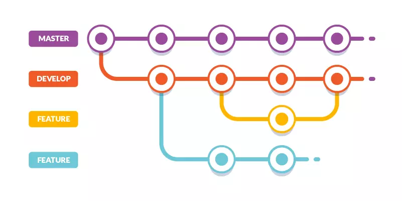
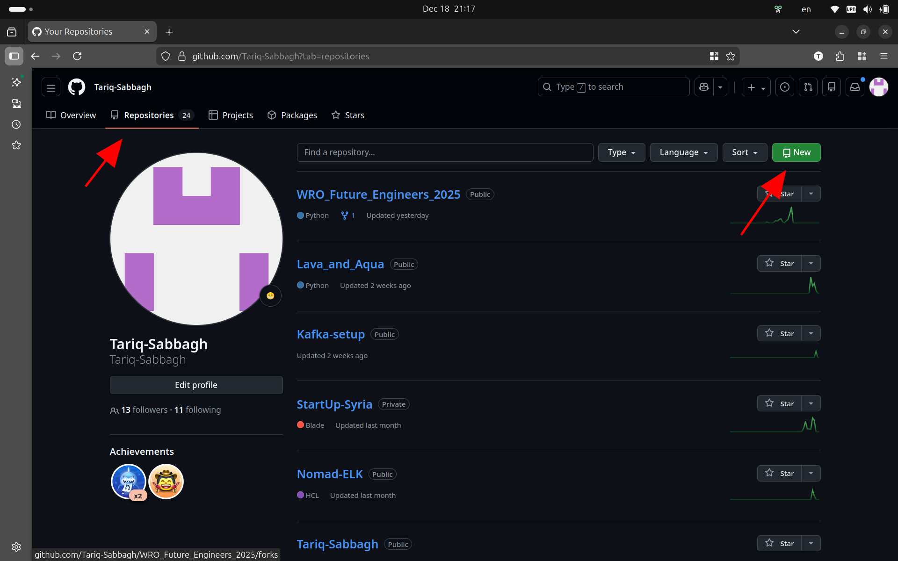
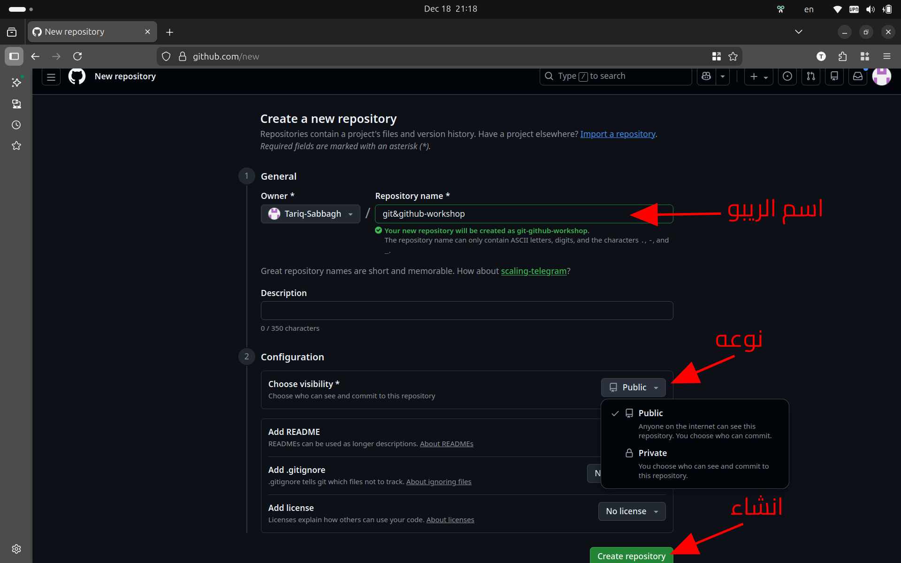
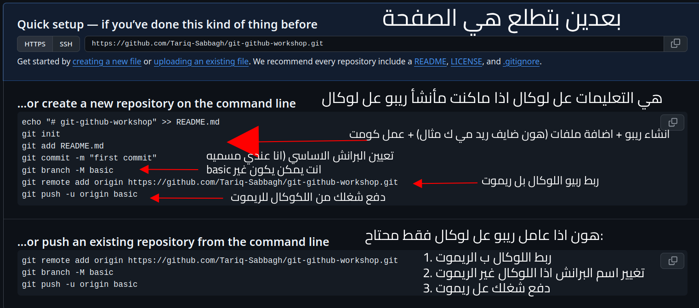

<div dir="rtl">

# ملخص ورشة: Git و GitHub

هذا الملف يلخّص النقاط الأساسية التي تم شرحها في الورشة مع أهم الأوامر وأمثلة سريعة.

---

## 1) Git vs GitHub (الفرق بينهم)

- **Git**: أداة على جهازك لإدارة الإصدارات (Version Control) وتتبع تغييرات الملفات محليًا.
- **GitHub**: منصة على الإنترنت لاستضافة مستودعات Git ومشاركتها وتسهيل التعاون (Pull Requests, Issues…).
- باختصار: **Git = نظام تتبع تغييرات**، **GitHub = مكان/خدمة لمشاركة المستودع والعمل الجماعي**.

---

## 2) مفهوم Version Control بشكل مبسط

- يساعدك تحتفظ بتاريخ المشروع: مين غيّر شو؟ ومتى؟ وليش؟
- تقدر ترجع لإصدار قديم (Commit) عند الحاجة.
- يسهل العمل ضمن فريق بدون تخريب شغل بعض.

> **مصطلحات سريعة**
> - **Repository (Repo)**: مشروع Git  
> - **Commit**: لقطة محفوظة من التغييرات مع رسالة  
> - **Branch**: مسار عمل منفصل لتجربة/ميزة جديدة  

---

## 3) Snapshot (اللقطة) في Git

Git يعتمد فكرة “لقطات” لحالة الملفات عند كل **Commit**. كل Commit يمثل نقطة واضحة بالتاريخ تقدر ترجع لها أو تقارن بينها وبين غيرها.

```text
Working Directory  →  Staging Area  →  Commit History
```

---

## 4) تثبيت Git

الرابط الرسمي لتحميل Git (Windows / macOS / Linux):  
https://git-scm.com/downloads

بعد التثبيت جرّب تتأكد من التيرمينال : 

```bash
git --version
```

---

## 5) التطبيق العملي الأساسي (الأوامر التي استخدمناها)

### إعداد الاسم والإيميل (مرة واحدة غالبًا)

```bash
# إعداد على مستوى الجهاز (مفضل لمعظم الحالات)
git config --global user.name  "Your Name"
git config --global user.email "you@example.com"

# إعداد على مستوى مشروع محدد فقط
git config --local user.name  "Your Name"
git config --local user.email "you@example.com"
```

### الأوامر الأساسية

| الأمر | ماذا يفعل؟ |
|---|---|
| `git init` | ينشئ مستودع Git جديد في المجلد الحالي (يضيف مجلد `.git`). |
| `git status` | يعرض حالة الملفات: معدّلة؟ مضافة للـ staging؟ |
| `git add .` | يضيف التغييرات إلى **Staging Area** للتحضير للـ commit. |
| `git commit -m "msg"` | يحفظ Snapshot للتغييرات الموجودة في staging مع رسالة توضّح الهدف. |

**سير عمل شائع:**

```bash
git init
git status
git add .
git commit -m "Initial commit"
```

---

## 6) `git log`: كيف Git يخزن كل خطوة وكيف أرجع لـ commit قديم

`git log` يعرض تاريخ الـ commits (كل Commit له **hash** فريد).

```bash
# عرض التاريخ
git log

# عرض مختصر (مفيد جدًا)
git log --oneline
```

### الرجوع لِـ commit قديم (للمعاينة)

```bash
# الانتقال لمعاينة نسخة قديمة (قد تدخل وضع Detached HEAD)
git checkout <commit-hash>
# أو (في الإصدارات الأحدث)
git switch --detach <commit-hash>
```

> **تنبيه:** الرجوع “للمعاينة” شيء، وتغيير التاريخ/إرجاع الفرع للخلف شيء آخر (مثل reset).  

### العودة للفرع الحالي

```bash
git checkout main
# أو
git switch main
```

---

## 7) البرانشات (Branches) — الفكرة والأوامر

البرانش هو “مسار عمل” مستقل. غالبًا منترك `main` مستقر، ومننشئ برانش للميزة الجديدة، منشتغل عليه، وبعدين مندمجه.

| الأمر | ماذا يفعل؟ |
|---|---|
| `git branch` | يعرض البرانشات المحلية (النجمة تشير للبرانش الحالي). |
| `git branch feature-x` | ينشئ برانش جديد اسمه `feature-x`. |
| `git checkout feature-x` | ينتقل لبرانش موجود. |
| `git checkout -b feature-x` | ينشئ برانش جديد + ينتقل له مباشرة. |
| `git switch feature-x` | بديل أحدث للانتقال بين البرانشات. |
| `git switch -c feature-x` | بديل أحدث: إنشاء برانش جديد + الانتقال له. |

### رسم توضيحي 


---

## 8) الميرج (Merge) وأنواعه + الـ Conflict

### متى نستخدم merge؟
- لدمج تغييرات برانش (feature) مع برانش آخر (main).

### أوامر merge الأساسية

```bash
# 1) انتقل للبرانش الذي تريد دمج التغييرات إليه (عادة main)
git checkout main
# أو
git switch main

# 2) ادمج برانش الميزة
git merge feature-x
```

### أنواع شائعة
- **Fast-Forward**: إذا كان `main` لم يتغير، Git فقط “يحرك المؤشر” للأمام بدون commit دمج منفصل.
- **3-Way Merge**: إذا كان هناك تغييرات على الطرفين، Git ينشئ **Merge Commit**.
- **Squash Merge** (شائع على GitHub): يجمع عدة commits من البرانش في commit واحد عند الدمج (غالبًا من واجهة GitHub).

### الـ Conflict (تعارض)
يصير لما نفس السطر/الجزء من الملف اتعدل بطريقتين مختلفتين في برانشين.

1. شغّل `git status` لتعرف الملفات المتعارضة.
2. افتح الملفات وحل التعارضات (Git يضع علامات داخل الملف).
3. بعد الحل: `git add` للملفات، ثم `git commit` لإكمال الدمج (إذا تطلب).

```bash
git status
# افتح الملفات وحل التعارض
git add .
git commit -m "Resolve merge conflict"
```

---

## 9) GitHub — لمحة سريعة

- إنشاء مستودعات (Repositories) على الإنترنت.
- إدارة البرانشات والعمل الجماعي.
- Pull Requests لمراجعة الكود والدمج.
- Issues لتتبع المهام والمشاكل.

---

## 10) Pull Request (PR)

الـ PR هو طلب دمج تغييرات من برانش إلى برانش آخر (غالبًا من `feature` إلى `main`) مع إمكانية المراجعة والتعليق والموافقة قبل الدمج.

**خطوات عامة على GitHub:**
1. تدفع برانش الميزة إلى GitHub.
2. تفتح Pull Request وتشرح التغيير.
3. الفريق يعمل Review، وبعدها دمج (Merge) مع اختيار نوع الدمج.

---

## 11) أوامر إضافية (Clone / Push / Pull)

### `git clone`
ينسخ مستودع موجود على GitHub إلى جهازك (مع إعداد remote تلقائيًا).

```bash
git clone https://github.com/USER/REPO.git
```

### `git push`
يرسل commits من جهازك إلى الـ remote (مثل GitHub).

```bash
git push
```

### `git pull`
يجلب آخر التغييرات من الـ remote ويدمجها محليًا (Fetch + Merge غالبًا).

```bash
git pull
```

> نصيحة فريق: قبل ما تبدأ شغل أو قبل ما تدفع شغلك، اعمل `git pull` لتتجنب تعارضات كثيرة.

---

## 12) إنشاء Repo على GitHub وربطه مع Local + معنى `origin`

### ما هو `origin`؟
`origin` هو اسم افتراضي (Nickname) للـ remote الرئيسي (غالبًا رابط GitHub للمستودع).  
يعني بدل ما تكتب الرابط كل مرة، Git بيتعامل معه باسم مختصر.

### سيناريو 1: مشروع محلي وبدك ترفعه لأول مرة على GitHub

```bash
# إذا لم يكن Repo بعد:
git init

# أضف الملفات ثم أول commit
git add .
git commit -m "Initial commit"

# اربط الـ repo المحلي بالـ repo على GitHub
git remote add origin https://github.com/USER/REPO.git

# (اختياري شائع) تأكد اسم الفرع الرئيسي main
git branch -M main

# ارفع لأول مرة + اجعل main يتتبع origin/main
git push -u origin main
```

### سيناريو 2: Repo موجود على GitHub وبدك تنزله وتشتغل عليه

```bash
git clone https://github.com/USER/REPO.git
cd REPO
```

### أوامر مفيدة للـ remotes

```bash
# عرض الروابط المسجلة
git remote -v

# تغيير رابط origin (إذا تغيرت الرابط/المنظمة…)
git remote set-url origin https://github.com/USER/REPO.git
```

###  “كيف أنشئ Repo على GitHub”


<p></p>

<p></p>

</div>
